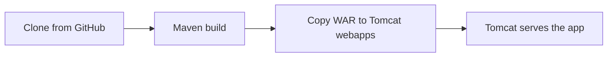

# Netflix Login Page: Jenkins Pipeline to Apache Tomcat

A Maven WAR web application (a Netflix-style login page) and a Jenkins pipeline, built up in three steps, that clones, builds and deploys it to Apache Tomcat.

> Educational project. Not affiliated with or endorsed by Netflix.


## Pipeline

The `Script` file contains the pipeline at three levels of completeness, so it can be built up and verified one stage at a time:

| Version | Stages |
|---|---|
| 1 | Clone the code |
| 2 | Clone → Maven build (`mvn clean package -T 1C -DskipTests`) |
| 3 | Clone → Maven build → copy `target/NETFLIX-1.2.2.war` into `/root/apache-tomcat-9.0.93/webapps` |

Every version cleans the workspace after the build.



## Jenkins setup

- A Maven installation configured under the name `maven s/w`
- Git credentials with the ID `git-creds`
- The clone stage points at the upstream course repository; change the URL in `Script` to build your own copy
- For version 3, the Jenkins user must be able to copy into Tomcat's directory. The course grants this with `sudo visudo`:

  ```text
  jenkins ALL=(ALL) NOPASSWD: /bin/cp
  ```

  That rule lets Jenkins overwrite any file on the machine as root. Outside a lab, run Tomcat as a user Jenkins can write to, or limit `sudo` to a single deploy script.

## Build locally

```bash
mvn clean package
```

## Repository structure

```text
Script                                 Jenkins pipeline, versions 1 to 3
pom.xml                                WAR packaging
src/main/webapp/index.jsp              Login page
src/main/webapp/style.css              Styles
src/main/java/.../Calculator.java      Sample class
src/test/java/.../CalculatorTest.java  Unit test
```

## Credits

Pipeline based on [KastroVKiran/Netflix-Pipeline-Project](https://github.com/KastroVKiran/Netflix-Pipeline-Project) from Learn With Kastro. Login page design by CodingNepal.

---

<div align="center">
  <sub>Maintained by <a href="https://github.com/RajGenStack">Rajan Kumar</a> · <a href="https://www.linkedin.com/in/rajan-kumar42">LinkedIn</a></sub>
</div>
